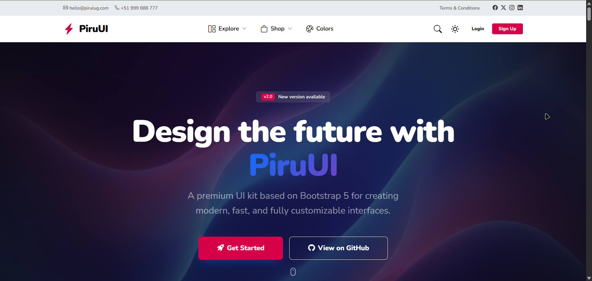

<div align="center">
  
  <h1>PiruUI Bootstrap 5 UI Kit</h1>
  <p><strong>A modern, premium, and highly customizable UI Kit built with Bootstrap 5, Pug, and Sass.</strong></p>

  [](https://github.com/pirulug/piruui-bootstrap-5-ui-kit)
  [](LICENSE)
  [](https://getbootstrap.com/)
  [](https://sass-lang.com/)

  [Live Demo](https://pirulug.github.io/piruui-bootstrap-5-ui-kit/) | [Download Release](https://github.com/pirulug/piruui-bootstrap-5-ui-kit/releases)
</div>

---



## Overview

**PiruUI** is a premium set of UI components and utilities designed to accelerate the development of stunning, responsive web interfaces. It combines the power of **Bootstrap 5** with the flexibility of **Pug** templates and **Sass** modularity, providing a solid foundation for any modern web project.

## Features

- **Premium Aesthetics**: Borderless design, vibrant color palettes, and modern typography by default.
- **Dynamic Dark/Light Mode**: Full support for system-aware and manual theme switching with Bootstrap 5.3 standards.
- **Responsive Brand System**: Advanced navbar brand support for multiple styles (Image, Image + Title, or Text/Icon).
- **Pug Powered**: Modular and clean templating system for faster development and maintenance.
- **Sass Modularity**: Custom components organized in professional SCSS structures.
- **Webpack Build System**: Optimized build process with CSS extraction, minification, and live reload.
- **Mobile First**: Fully responsive layouts optimized for all device sizes.

## Tech Stack

- **Core**: HTML5, JavaScript (ES6+), CSS3
- **Framework**: [Bootstrap 5.3+](https://getbootstrap.com/)
- **Templating**: [Pug](https://pugjs.org/)
- **Styling**: [Sass (SCSS)](https://sass-lang.com/) & [PostCSS](https://postcss.org/)
- **Build Tool**: [Webpack 5](https://webpack.js.org/)

## Installation

To start using PiruUI, clone the repository and install the dependencies:

```bash
# Clone the repository
git clone https://github.com/pirulug/piruui-bootstrap-5-ui-kit.git

# Enter the directory
cd piruui-bootstrap-5-ui-kit

# Install dependencies
pnpm install # or npm install
```

## Usage

### Development
Run the development server with live reload:
```bash
pnpm run start
```

### Production Build
Generate optimized files in the `dist/` directory:
```bash
pnpm run build
```

### Deployment
Deploy the `dist` folder to GitHub Pages:
```bash
pnpm run deploy
```

### Export to ZIP
Create a versioned distribution package:
```bash
pnpm run zip
```

## Configuration

Site-wide variables are managed centrally in `webpack.config.js` via `templateParameters`:

```javascript
// webpack.config.js
templateParameters: {
  siteName: 'PiruUI',
  navLogoStyle: 'text', // Options: 'image', 'image-title', 'text'
  logoLight: 'img/logo/piruui-dark-logo.png',
  logoDark: 'img/logo/piruui-white-logo.png'
}
```

## Contributing

Contributions are what make the open source community such an amazing place to learn, inspire, and create. Any contributions you make are **greatly appreciated**.

1. Fork the Project
2. Create your Feature Branch (`git checkout -b feature/AmazingFeature`)
3. Commit your Changes (`git commit -m 'Add some AmazingFeature'`)
4. Push to the Branch (`git push origin feature/AmazingFeature`)
5. Open a Pull Request

## License

Distributed under the MIT License. See `LICENSE` for more information.

## Author

Developed by **[Pirulug](https://github.com/pirulug)**.

---
<div align="center">
  <p>© 2026 PiruUI. Built for developers by developers.</p>
</div>